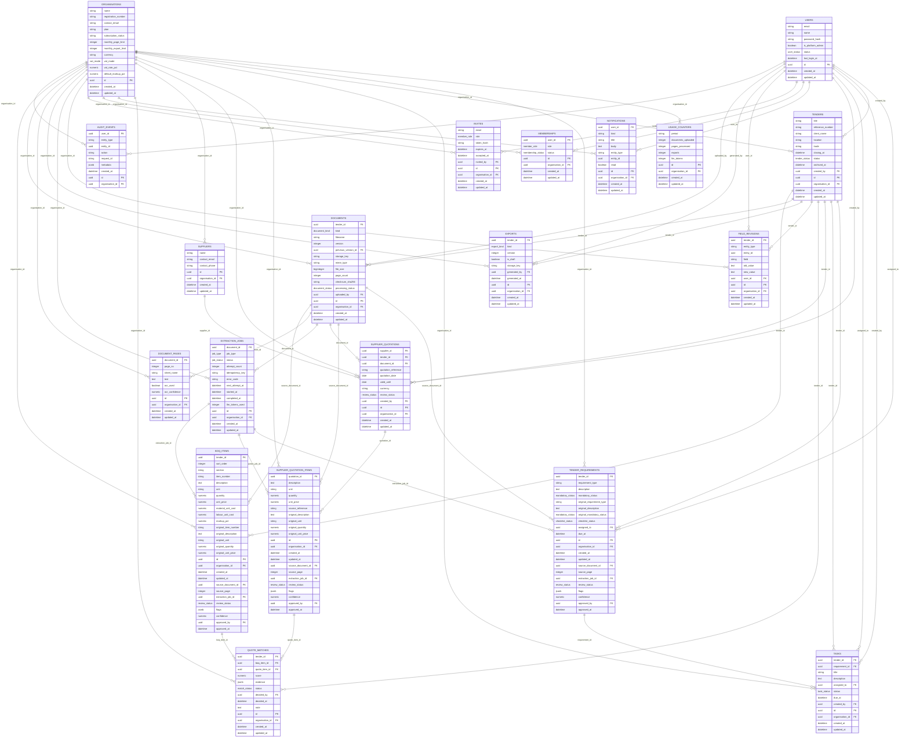

# Entity relationship diagram

Generated from `backend/app/core/models` by `python -m scripts.export_erd`. Do not edit by hand.

```mermaid
erDiagram
  AUDIT_EVENTS {
    uuid user_id FK
    string entity_type
    uuid entity_id
    string action
    string request_id
    jsonb metadata
    datetime created_at
    uuid id PK
    uuid organisation_id FK
  }
  BOQ_ITEMS {
    uuid tender_id FK
    integer sort_order
    string section
    string item_number
    text description
    string unit
    numeric quantity
    numeric unit_price
    numeric material_unit_cost
    numeric labour_unit_cost
    numeric markup_pct
    string original_item_number
    text original_description
    string original_unit
    numeric original_quantity
    numeric original_unit_price
    uuid id PK
    uuid organisation_id FK
    datetime created_at
    datetime updated_at
    uuid source_document_id FK
    integer source_page
    uuid extraction_job_id FK
    review_status review_status
    jsonb flags
    numeric confidence
    uuid approved_by FK
    datetime approved_at
  }
  DOCUMENT_PAGES {
    uuid document_id FK
    integer page_no
    string sheet_name
    text text
    boolean ocr_used
    numeric ocr_confidence
    uuid id PK
    uuid organisation_id FK
    datetime created_at
    datetime updated_at
  }
  DOCUMENTS {
    uuid tender_id FK
    document_kind kind
    string filename
    integer version
    uuid previous_version_id FK
    string storage_key
    string mime_type
    biginteger file_size
    integer page_count
    string checksum_sha256
    document_status processing_status
    uuid uploaded_by FK
    uuid id PK
    uuid organisation_id FK
    datetime created_at
    datetime updated_at
  }
  EXPORTS {
    uuid tender_id FK
    export_kind kind
    integer version
    boolean is_draft
    string storage_key
    uuid generated_by FK
    datetime generated_at
    uuid id PK
    uuid organisation_id FK
    datetime created_at
    datetime updated_at
  }
  EXTRACTION_JOBS {
    uuid document_id FK
    job_type job_type
    job_status status
    integer attempt_count
    string idempotency_key
    string error_code
    datetime next_attempt_at
    datetime started_at
    datetime completed_at
    integer llm_tokens_used
    uuid id PK
    uuid organisation_id FK
    datetime created_at
    datetime updated_at
  }
  FIELD_REVISIONS {
    uuid tender_id FK
    string entity_type
    uuid entity_id
    string field
    text old_value
    text new_value
    uuid user_id FK
    uuid id PK
    uuid organisation_id FK
    datetime created_at
    datetime updated_at
  }
  INVITES {
    string email
    member_role role
    string token_hash
    datetime expires_at
    datetime accepted_at
    uuid invited_by FK
    uuid id PK
    uuid organisation_id FK
    datetime created_at
    datetime updated_at
  }
  MEMBERSHIPS {
    uuid user_id FK
    member_role role
    membership_status status
    uuid id PK
    uuid organisation_id FK
    datetime created_at
    datetime updated_at
  }
  NOTIFICATIONS {
    uuid user_id FK
    string kind
    string title
    text body
    string entity_type
    uuid entity_id
    boolean read
    uuid id PK
    uuid organisation_id FK
    datetime created_at
    datetime updated_at
  }
  ORGANISATIONS {
    string name
    string registration_number
    string contact_email
    string plan
    string subscription_status
    integer monthly_page_limit
    integer monthly_export_limit
    string currency
    vat_mode vat_mode
    numeric vat_rate_pct
    numeric default_markup_pct
    uuid id PK
    datetime created_at
    datetime updated_at
  }
  QUOTE_MATCHES {
    uuid tender_id FK
    uuid boq_item_id FK
    uuid quote_item_id FK
    numeric score
    jsonb evidence
    match_status status
    uuid decided_by FK
    datetime decided_at
    text note
    uuid id PK
    uuid organisation_id FK
    datetime created_at
    datetime updated_at
  }
  SUPPLIER_QUOTATION_ITEMS {
    uuid quotation_id FK
    text description
    string unit
    numeric quantity
    numeric unit_price
    string source_reference
    text original_description
    string original_unit
    numeric original_quantity
    numeric original_unit_price
    uuid id PK
    uuid organisation_id FK
    datetime created_at
    datetime updated_at
    uuid source_document_id FK
    integer source_page
    uuid extraction_job_id FK
    review_status review_status
    jsonb flags
    numeric confidence
    uuid approved_by FK
    datetime approved_at
  }
  SUPPLIER_QUOTATIONS {
    uuid supplier_id FK
    uuid tender_id FK
    uuid document_id FK
    string quotation_reference
    date quotation_date
    date valid_until
    string currency
    review_status review_status
    uuid created_by FK
    uuid id PK
    uuid organisation_id FK
    datetime created_at
    datetime updated_at
  }
  SUPPLIERS {
    string name
    string contact_email
    string contact_phone
    uuid id PK
    uuid organisation_id FK
    datetime created_at
    datetime updated_at
  }
  TASKS {
    uuid tender_id FK
    uuid requirement_id FK
    string title
    text description
    uuid assigned_to FK
    task_status status
    datetime due_at
    uuid created_by FK
    uuid id PK
    uuid organisation_id FK
    datetime created_at
    datetime updated_at
  }
  TENDER_REQUIREMENTS {
    uuid tender_id FK
    string requirement_type
    text description
    mandatory_status mandatory_status
    string original_requirement_type
    text original_description
    mandatory_status original_mandatory_status
    checklist_status checklist_status
    uuid assigned_to FK
    datetime due_at
    uuid id PK
    uuid organisation_id FK
    datetime created_at
    datetime updated_at
    uuid source_document_id FK
    integer source_page
    uuid extraction_job_id FK
    review_status review_status
    jsonb flags
    numeric confidence
    uuid approved_by FK
    datetime approved_at
  }
  TENDERS {
    string title
    string reference_number
    string client_name
    string location
    string trade
    datetime closing_at
    tender_status status
    datetime archived_at
    uuid created_by FK
    uuid id PK
    uuid organisation_id FK
    datetime created_at
    datetime updated_at
  }
  USAGE_COUNTERS {
    string period
    integer documents_uploaded
    integer pages_processed
    integer exports
    integer llm_tokens
    uuid id PK
    uuid organisation_id FK
    datetime created_at
    datetime updated_at
  }
  USERS {
    string email
    string name
    string password_hash
    boolean is_platform_admin
    user_status status
    datetime last_login_at
    uuid id PK
    datetime created_at
    datetime updated_at
  }
  BOQ_ITEMS ||--o{ QUOTE_MATCHES : "boq_item_id"
  DOCUMENTS ||--o{ BOQ_ITEMS : "source_document_id"
  DOCUMENTS ||--o{ DOCUMENT_PAGES : "document_id"
  DOCUMENTS ||--o{ EXTRACTION_JOBS : "document_id"
  DOCUMENTS ||--o{ SUPPLIER_QUOTATIONS : "document_id"
  DOCUMENTS ||--o{ SUPPLIER_QUOTATION_ITEMS : "source_document_id"
  DOCUMENTS ||--o{ TENDER_REQUIREMENTS : "source_document_id"
  EXTRACTION_JOBS ||--o{ BOQ_ITEMS : "extraction_job_id"
  EXTRACTION_JOBS ||--o{ SUPPLIER_QUOTATION_ITEMS : "extraction_job_id"
  EXTRACTION_JOBS ||--o{ TENDER_REQUIREMENTS : "extraction_job_id"
  ORGANISATIONS ||--o{ AUDIT_EVENTS : "organisation_id"
  ORGANISATIONS ||--o{ BOQ_ITEMS : "organisation_id"
  ORGANISATIONS ||--o{ DOCUMENTS : "organisation_id"
  ORGANISATIONS ||--o{ DOCUMENT_PAGES : "organisation_id"
  ORGANISATIONS ||--o{ EXPORTS : "organisation_id"
  ORGANISATIONS ||--o{ EXTRACTION_JOBS : "organisation_id"
  ORGANISATIONS ||--o{ FIELD_REVISIONS : "organisation_id"
  ORGANISATIONS ||--o{ INVITES : "organisation_id"
  ORGANISATIONS ||--o{ MEMBERSHIPS : "organisation_id"
  ORGANISATIONS ||--o{ NOTIFICATIONS : "organisation_id"
  ORGANISATIONS ||--o{ QUOTE_MATCHES : "organisation_id"
  ORGANISATIONS ||--o{ SUPPLIERS : "organisation_id"
  ORGANISATIONS ||--o{ SUPPLIER_QUOTATIONS : "organisation_id"
  ORGANISATIONS ||--o{ SUPPLIER_QUOTATION_ITEMS : "organisation_id"
  ORGANISATIONS ||--o{ TASKS : "organisation_id"
  ORGANISATIONS ||--o{ TENDERS : "organisation_id"
  ORGANISATIONS ||--o{ TENDER_REQUIREMENTS : "organisation_id"
  ORGANISATIONS ||--o{ USAGE_COUNTERS : "organisation_id"
  SUPPLIERS ||--o{ SUPPLIER_QUOTATIONS : "supplier_id"
  SUPPLIER_QUOTATIONS ||--o{ SUPPLIER_QUOTATION_ITEMS : "quotation_id"
  SUPPLIER_QUOTATION_ITEMS ||--o{ QUOTE_MATCHES : "quote_item_id"
  TENDERS ||--o{ BOQ_ITEMS : "tender_id"
  TENDERS ||--o{ DOCUMENTS : "tender_id"
  TENDERS ||--o{ EXPORTS : "tender_id"
  TENDERS ||--o{ FIELD_REVISIONS : "tender_id"
  TENDERS ||--o{ QUOTE_MATCHES : "tender_id"
  TENDERS ||--o{ SUPPLIER_QUOTATIONS : "tender_id"
  TENDERS ||--o{ TASKS : "tender_id"
  TENDERS ||--o{ TENDER_REQUIREMENTS : "tender_id"
  TENDER_REQUIREMENTS ||--o{ TASKS : "requirement_id"
  USERS ||--o{ AUDIT_EVENTS : "user_id"
  USERS ||--o{ DOCUMENTS : "uploaded_by"
  USERS ||--o{ EXPORTS : "generated_by"
  USERS ||--o{ FIELD_REVISIONS : "user_id"
  USERS ||--o{ INVITES : "invited_by"
  USERS ||--o{ MEMBERSHIPS : "user_id"
  USERS ||--o{ NOTIFICATIONS : "user_id"
  USERS ||--o{ SUPPLIER_QUOTATIONS : "created_by"
  USERS ||--o{ TASKS : "assigned_to"
  USERS ||--o{ TASKS : "created_by"
  USERS ||--o{ TENDERS : "created_by"
  USERS ||--o{ TENDER_REQUIREMENTS : "assigned_to"
```
